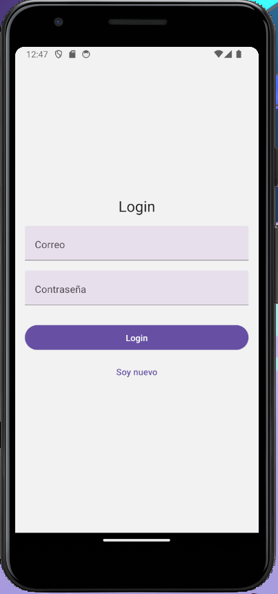
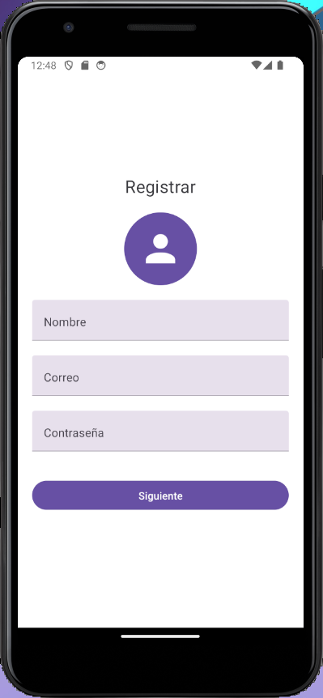
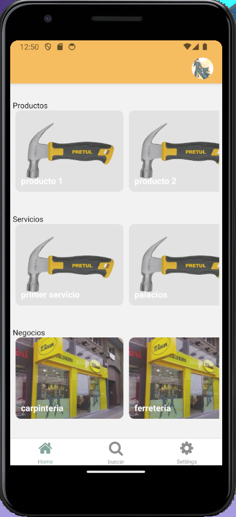
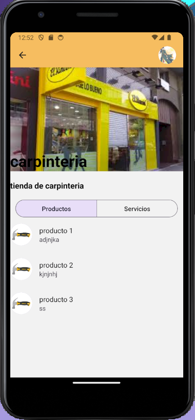
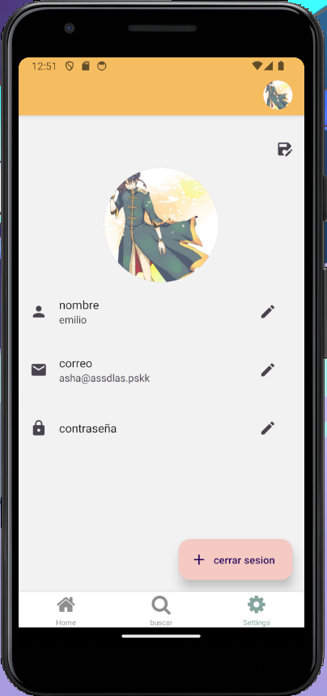

# NegociosCol APP








---

**panel: [negocioscol.com](https://negocioscol.vercel.app/)**

**appi: [api-negosioscol](https://api-negosioscol-production.up.railway.app)**

**app: [negocioscol.com](https://negocioscol.vercel.app/)**


- [NegociosCol APP](#negocioscol-app)
  - [Requisitos de instalación](#requisitos-de-instalación)
  - [API](#api)
    - [Instrucciones para la instalación](#instrucciones-para-la-instalación)
  - [PANEL](#panel)
    - [Instrucciones para la instalación](#instrucciones-para-la-instalación-1)
  - [APP](#app)
    - [Instrucciones para la instalación](#instrucciones-para-la-instalación-2)


## Requisitos de instalación
## API

Asegúrate de tener instalado y configurado Docker antes de comenzar.

- [Docker](https://www.docker.com)

### Instrucciones para la instalación

1. Clonar el repositorio de la API en la máquina local:
   
   ```sh
   git clone https://github.com/LuisDeLaValie/api_negosioscol.git
   ```

2. Navegar al directorio del proyecto:
   
   ```sh
   cd api_negosioscol
   ```

3. Ejecutar el siguiente comando para iniciar los contenedores:

    ```sh
    docker-compose up -d
    ```

    > **IMPORTANTE**
    >
    > Debe estar iniciado el Docker engine para ejecutar el comando anterior,
    > si no lo está, se devolverá un mensaje de error indicando que no se
    > encontró el docker daemon.

4. La API estará disponible en `http://localhost:8081`.


5. Clonar el repositorio del panel en la máquina local:
   
   ```sh
   git clone https://github.com/LuisDeLaValie/negocioscol-panel.git
   ```

6. Navegar al directorio del proyecto:
   
   ```sh
   cd negocioscol-panel
   ```
7. Insertar las dependencia de la aplicación
   
   ```sh
   npm i
   ```
8. Renombrar el archivo `.env.example` a `.env.local` para agregar la variable de entorno. Asegurese de que  `NEXT_PUBLIC_PUBLIC_API_URL` tenga la ruta de la API
    > NOTA:
    > Este proyecto usa NEXTJS por lo que es importante que el `.env` tenga el nombre `.env.local` de lo contrario nextjs no reconocera los env
    >
    > para mas informacion ver [nextjs environment](https://nextjs.org/docs/app/building-your-application/configuring/environment-variables)

9. Ejecutar el panel
    ```sh
    npm run dev
    ```
## PANEL

### Instrucciones para la instalación

1. Clonar el repositorio del panel en la máquina local:
   
   ```sh
   git clone https://github.com/LuisDeLaValie/negocioscol-panel.git
   ```

2. Navegar al directorio del proyecto:
   
   ```sh
   cd negocioscol-panel
   ```
3. Insertar las dependencia de la aplicación
   
   ```sh
   npm i
   ```
4. Renombrar el archivo `.env.example` a `.env.local` para agregar la variable de entorno. Asegurese de que  `NEXT_PUBLIC_PUBLIC_API_URL` tenga la ruta de la API
    > NOTA:
    > Este proyecto usa NEXTJS por lo que es importante que el `.env` tenga el nombre `.env.local` de lo contrario nextjs no reconocera los env
    >
    > para mas informacion ver [nextjs environment](https://nextjs.org/docs/app/building-your-application/configuring/environment-variables)

5. Ejecutar el panel
    ```sh
    npm run dev
    ```
## APP

### Instrucciones para la instalación

1. Clonar el repositorio de la app en la máquina local:
   
   ```sh
   git clone https://github.com/LuisDeLaValie/negocioscol-app.git
   ```

2. Navegar al directorio del proyecto:
   
   ```sh
   cd negocioscol-app
   ```
3. Insertar las dependencia de la aplicación
   
   ```sh
   npm i
   ```
4. Renombrar el archivo `.env.example` a `.env` para agregar la variable de entorno. Asegurese de que  `EXPO_PUBLIC_API_URL` tenga la ruta de la API
    > NOTA:
    > Este proyecto usa EXPO.
    > para mas informacion ver [Environment variables in Expo](https://docs.expo.dev/guides/environment-variables/)


5. Redirigiremos el trafico de nuetra api a nuetro emulador con el siguinte comando. Esto es para poder escuchar el puerto 8081 de nuetro local en el emulador
   
```sh
 adb -s emulator-5554 reverse tcp:8081 tcp:8081
```
   > Asegurece de tener el emulador ejecutando para que este pueda conectarse
   


1. Ejecutar el APP
    ```sh
    npm run android
    ```